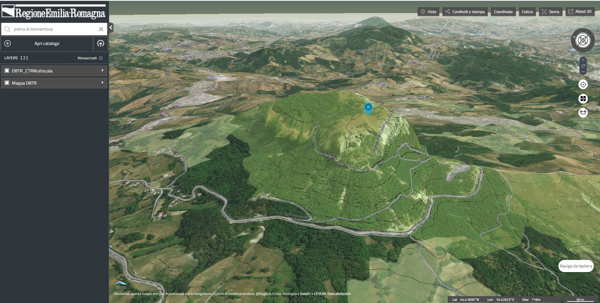

RER3D-MAP
======
  
  
  

The **rer3d-map** is a website for map-based access to italian [Emilia-Romagna region](http://www.regione.emilia-romagna.it) spatial data from local government agencies.
The software has been developed and customized by [Bioretics srl](http://www.bioretics.com).

This is a complete website built using the TerriaJS library. See the [TerriaJS README](https://github.com/TerriaJS/TerriaJS) for information and documentation about TerriaJS.

Go to the [wiki page](https://github.com/bioretics/rer3d-map/wiki) for installation guide.

