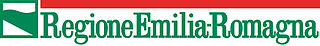
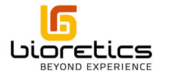
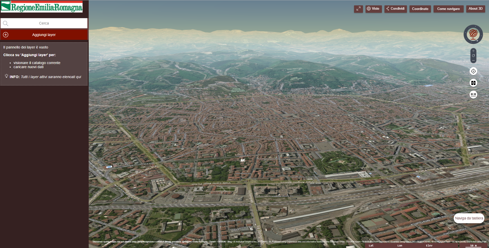

RER3D-MAP
======

The **RER3D-MAP** is a website for map-based access to italian [Emilia-Romagna region](http://www.regione.emilia-romagna.it) spatial data from local government agencies.
The software has been developed and customized by [Bioretics srl](http://www.bioretics.com).

This is a complete website built using the TerriaJS library. See the [TerriaJS README](https://github.com/TerriaJS/TerriaJS) for information about TerriaJS, and getting started using this repository.

Go to the [installation guide](https://github.com/glughi/rer3d-map/wiki/Installation)

